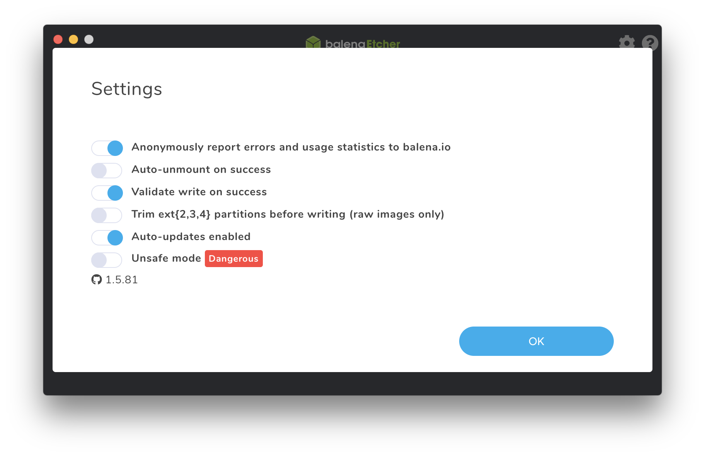
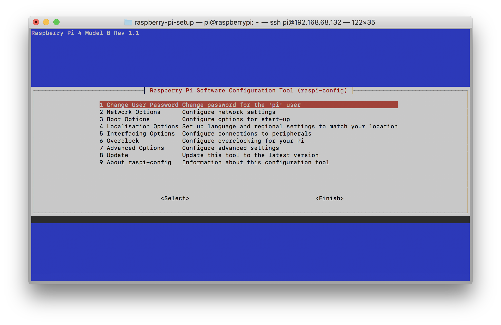

# Raspberry Pi Setup

## Download and Etch to Micro SD Card

1.  Download the latest _Raspbian with desktop_ from
    https://www.raspberrypi.org/downloads/raspbian/:
    https://downloads.raspberrypi.org/raspbian_latest

2.  Download [Etcher](https://www.balena.io/etcher/)

3.  Etch Raspbian zip to your micro SD card with Etcher.
    In settings, uncheck _Auto-unmount on success_.

    

4.  Enable ssh for headless setup:

    ```bash
    cd /Volumes/boot
    touch ssh
    ```

## Start Up Raspberry Pi

1.  Plug raspberry pi into an ethernet port on your router and connect it to
    power.

2.  Use your router web interface or app to determine what IP address has been
    given to your raspberry pi.

## Initial Raspberry Pi Configuration and Update

1.  SSH into your raspberry pi (default user is `pi` and default password is
    `raspberry`):

    ```bash
    ssh pi@[raspberry pi IP address]
    # enter raspberry as the password
    ```

2.  Perform initial configuration for your raspberry pi:

    ```bash
    sudo raspi-config
    ```

    

    Use the arrows keys to move between option, the TAB key to switch between
    buttons, and the ENTER key to make a selection.

    i. Change your password - option 1

    ii. Configure WiFi - option 2 (Network Options), then option N2 (Wi-fi)

        a.  Set your country

        b.  Enter your SSID

        c.  Enter your passphrase

    iii. Enable VNC - option 5 (Interfacing Options), then option P3 (VNC)

    iv. Fix resolution - option 7 (Advanced Options), then A5 (Resolution)

        a. Choose the last option `DMT Mode 82 1920x1080 60Hz 16:9`

        b. Choose to reboot now

3.  Perform initial update:

    ```bash
    sudo apt update
    sudo apt full-upgrade
    sudo apt clean
    sudo reboot
    ```

## Software Installation

### Shells / Prompts

#### zsh

```bash
sudo apt install zsh
chsh -s /bin/zsh
# exit and ssh back in
# Choose 1 to setup zsh config
# Leave History (1) as is
# Configure Completion (2) - select 1 to turn on default completion
# Choose 3 to configure editing - select 1 and then v
# Choose 4 to configure shell options - 1s, 2s
# Choose 0 to save and exit
```

#### [Oh My Zsh](https://ohmyz.sh/)

```bash
sh -c "$(curl -fsSL https://raw.github.com/ohmyzsh/ohmyzsh/master/tools/install.sh)"
```

#### [powerlevel10k](https://github.com/romkatv/powerlevel10k)

```bash
git clone https://github.com/ryanoasis/nerd-fonts.git
cd nerd-fonts
./install.sh Meslo
git clone --depth=1 https://github.com/romkatv/powerlevel10k.git ${ZSH_CUSTOM:-~/.oh-my-zsh/custom}/themes/powerlevel10k
sed -i.bak 's#ZSH_THEME="[^"]*"#ZSH_THEME="powerlevel10k/powerlevel10k"#' ~/.zshrc
zsh
# or later...
p10k configure
# Answer initial questions - should be 4 y, or 3 y and then n
# My current prefs...
# Prompt Style - 3 (Rainbow)
# Character Set - 1 (Unicode)
# Show current time? - 3 (12-hour format)
# Prompt Separators - 4 (Round)
# Prompt Heads - 1 (Sharp)
# Prompt Tails - 1 (Flat)
# Prompt Height - 2 (2 lines)
# Prompt Connection - 2 (Dotted)
# Prompt Frame - 1 (No frame)
# Connection Color - 3 (Dark)
# Prompt Spacing - 2 (Sparse)
# Icons - 2 (Many icons)
# Prompt Flow - 2 (Fluent)
# Enable Transient Prompt? - n (No)
# Instant Prompt Mode - 3 (Verbose)
# Overwrite ~/.p10k.zsh? - y (Yes)
```

### Editors/IDEs

#### gVim

```bash
sudo apt install vim-gui-common vim-gtk
```

#### [Visual Studio Code](https://code.headmelted.com/)

```bash
sudo -s
. <( wget -O - https://code.headmelted.com/installers/apt.sh )
```

### v TODO v

### Language Tools/Frameworks

### pyenv

```bash
git clone https://github.com/pyenv/pyenv.git ~/.pyenv
echo 'export PYENV_ROOT="$HOME/.pyenv"' >> ~/.zshrc
echo 'export PATH="$PYENV_ROOT/bin:$PATH"' >> ~/.zshrc
echo -e 'if command -v pyenv 1>/dev/null 2>&1; then\n  eval "$(pyenv init -)"\nfi' >> ~/.zshrc
```
